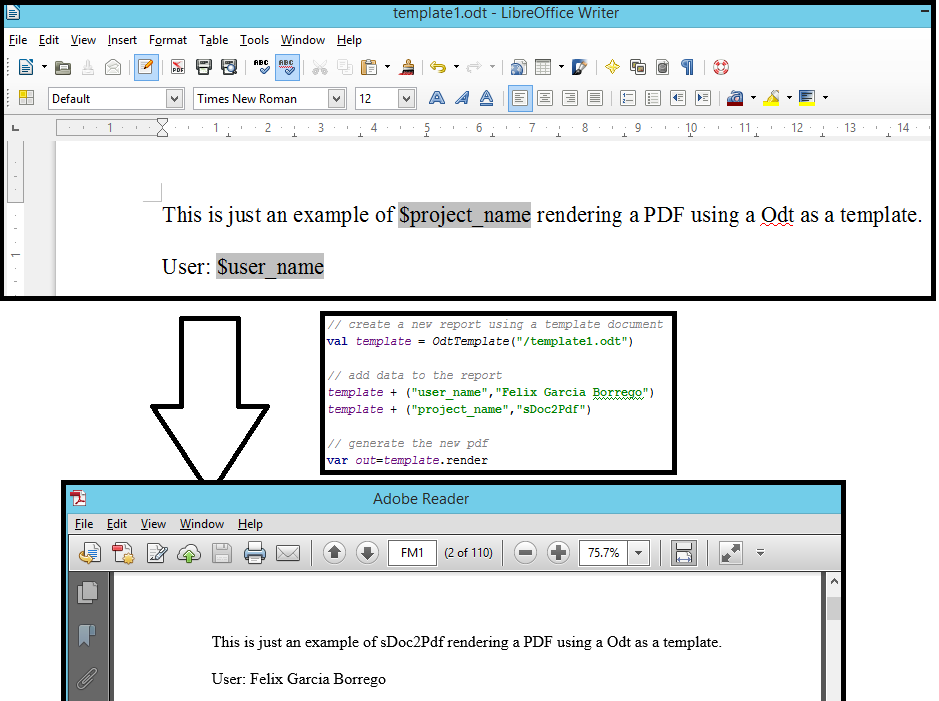

# sDoc2Pdf Scala lib

sDoc2Pdf is a Scala library that makes easy to create complex PDFs from Odt or Docx templates

On the backed it uses [xdocreport](https://code.google.com/p/xdocreport), inspired by [sPDF](https://github.com/cloudify/sPDF)

WARNING: This lib is just prototype. Do not use this with any expectation of stability, what is here is just an experiment over the weekend, and would need more work to reach a point where it could be used as a base for anything else.

## Usage

This library allows you to generate pdf documents or reports with your data from templates in an easy way.

```scala
// create a new report using a template document
val template = OdtTemplate("/template1.odt")

// add data to the template
template + ("user_name","Felix Garcia Borrego")
template + ("project_name","sDoc2Pdf")

// generate the new pdf
var out=template.render
```



## Roadmap

This project is still in a early stage, there are many things that should be improved:

- [ ] Use a a better scala idiom for the API
- [ ] Use non-blocking IO
- [ ] Add Test and production ready
- [ ] Streaming API
- [ ] Simplified API with implicits
- [ ] Integration with Play for streaming PDFs in HTTP responses
- [ ] Etc...
